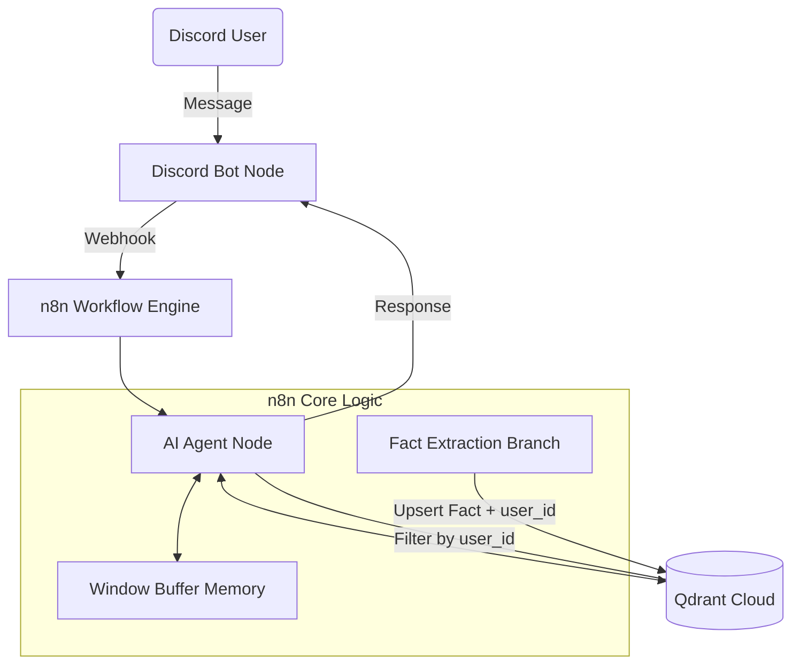

這是一份為你量身打造的**進階版開發計畫**。既然你是具備 n8n 與 Discord Bot 經驗的「總開發工程師」，這份計畫將重心放在**「1-2-2 戰鬥陣型」**，並強化了**多用戶隔離**與**產品化包裝**，確保你們在兩週內交出商業等級的成果。

---

# # ReMind - Capture Your Heart 開發計畫 (進階版)

> **專案類型**：期末作業 / 高階 AI 應用  
> **團隊人數**：5 人  
> **開發時程**：2 週（2024/12/17 - 2024/12/31）  
> **技術棧**：Discord Bot + n8n + Qdrant (Vector DB) + LLM (Gemini 1.5 Flash / GPT-4o-mini)

---

## 📋 專題目標

打造具備「深度情感連線」的 AI 陪伴者，不僅能聊天，還能「跨越時間記住你的每一件事」。

1.  **精準長期記憶**：利用 RAG 架構與 **Metadata Filtering** 實現多用戶隔離的記憶檢索。
2.  **用戶畫像提取**：不只存對話，更能主動提取用戶事實（Facts）以優化回應。
3.  **情感共鳴 UI**：利用 Discord Embeds 與主動關懷機制，創造超越工具的陪伴感。

---

## 🏗️ 系統架構 (Lead Engineer 核心架構)

---

## 👥 團隊分工 (1-2-2 戰鬥陣型)

| 角色 | 負責人 | 具體職責 |
|------|--------|----------|
| **總開發工程師** | **你** | **核心開發**：n8n 骨幹、Qdrant 串接、多用戶過濾邏輯、RAG 架構實作。 |
| **AI 訓練師 A** | 測試員 1 | **數據管理**：向量庫預熱數據、RAG 檢索精準度測試、Edge Case 排除。 |
| **AI 訓練師 B** | 測試員 2 | **靈魂調教**：System Prompt 工程、情緒反饋測試、不同模型效果對比。 |
| **產品設計師** | 文件員 1 | **UI/UX 包裝**：Discord Embed 樣式設計 (JSON)、Bot 頭像/人設視覺化、Demo 影片剪輯。 |
| **技術專案經理** | 文件員 2 | **文案與規格**：系統流程圖繪製、技術規格書撰寫、期末簡報製作。 |

---

## ⏰ 開發時程 (閃電開發模式)

### Week 1：MVP 快速成型（12/17 - 12/22）

*   **Day 1-2 (12/17-18) [MVP 衝刺]**：
    *   **你**：打通 Discord-n8n-Qdrant 鏈路，實作基本 RAG。
    *   **測試組**：準備 20 條測試事實，手動注入 Qdrant。
    *   **文件組**：產出 Bot 名字與基本人設。
*   **Day 3-4 (12/19-20) [功能細化]**：
    *   **你**：實作 **Metadata Filter (user_id)** 確保記憶不混亂。
    *   **測試組**：進行多用戶壓力測試，確認 A 的記憶不會被 B 讀到。
    *   **文件組**：設計 Discord 漂亮的 Embed 回覆格式。
*   **Day 5-7 (12/21-23) [首輪整合]**：完成「能記住用戶事實並用漂亮格式回覆」的穩定版本。

### Week 2：產品優化 & Demo（12/24 - 12/31）

*   **Day 1-2 (12/24-25) [進階功能]**：實作「事實提取分支」或「定時主動關懷」。
*   **Day 3-5 (12/26-28) [Demo 準備]**：
    *   **文件組**：撰寫三段式劇本（初識 -> 隔天回憶 -> 跨用戶隔離展示）。
    *   **測試組**：根據劇本進行 100% 完美的流程跑測。
*   **Day 6-7 (12/29-31) [最終衝刺]**：錄製 Demo 影片、定稿 PPT、準備上台。

---

## 🔧 技術選型

*   **自動化中心**：n8n (AI Agent Node 為核心)
*   **向量資料庫**：**Qdrant Cloud** (首選，支援快速 Metadata Filtering)
*   **大語言模型**：Gemini 1.5 Flash (速度快、Context Window 大，適合 RAG)
*   **記憶機制**：
    *   短期：Window Buffer Memory (存最近 5-10 輪對話)
    *   長期：Qdrant Vector Store (存用戶關鍵事實)

---

## 📝 核心功能規格 (老手開發重點)

### 1. 多用戶記憶隔離 (Security & Privacy)
*   **儲存**：每筆 Embedding 必須帶有 `user_id` 欄位。
*   **檢索**：n8n Qdrant Tool 必須設定 Filter：`user_id == {{ $json.user_id }}`。

### 2. 事實提取系統 (Fact Extraction)
*   在對話流結尾，增加一個 `Fact Extractor` 節點。
*   Prompt：「從上述對話中提取關於用戶的永久事實（如愛好、親友名字、重要紀念日），以第三人稱總結。」
*   將結果存入向量庫，而非儲存「所有」瑣碎對話，提升檢索效率。

### 3. Discord 高質感 UI
*   不使用純文字回覆。
*   **文件員** 負責提供 `Embed JSON`：包含標題、色彩條（隨情緒變換）、Footer（顯示陪伴天數）。

---

## ✅ 驗收標準 (Grading Points)

- [ ] **技術深度**：是否成功實作 RAG 且具備用戶隔離功能？
- [ ] **穩定性**：多用戶同時說話時，n8n 流程是否健壯 (Error Handling)？
- [ ] **擬人化**：AI 的回應是否能自然引用三天前的對話？
- [ ] **視覺呈現**：Discord UI 是否精美？簡報是否清楚呈現架構？

---

## 📊 Demo 劇本設計 (MVP 展示重點)

1.  **記憶點展示**：用戶 A 說：「我明天要去面試」，隔天問：「我今天要做什麼？」，Bot 答：「你要去面試喔，加油！」
2.  **安全性展示**：用戶 B 問：「你知道 A 要去幹嘛嗎？」，Bot 答：「我不知道耶，他沒跟我說過。」
3.  **情感化展示**：當用戶說「我好累」，Bot 用紅色 Embed 訊息框回覆，並帶入記憶：「記得你上次說過聽古典樂很有幫助，要不要試試？」

---

## 🚀 總工 (Lead) 今日行動清單 (Day 1)

1.  **環境**：開好 n8n 工作流，接通 Discord Webhook。
2.  **API**：申請 Qdrant Cloud Cluster，並在 n8n 建立 Credential。
3.  **骨架**：建立 `AI Agent` -> `Vector Store Tool` 的基本檢索鏈路。
4.  **下令**：
    *   叫**測試組**寫出 10 條 `user_id: A` 和 10 條 `user_id: B` 的測試事實。
    *   叫**文件組**選定 Bot 頭像並寫出 System Prompt。

---
*最後更新：2024/12/18*

