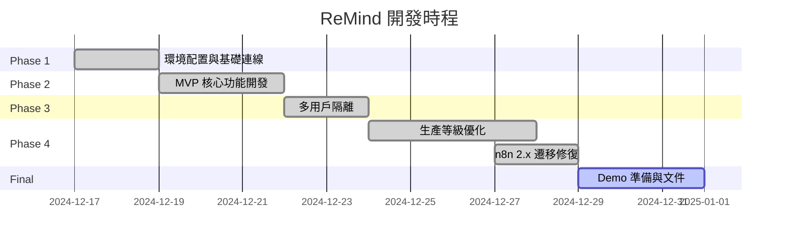

# ReMind - Capture Your Heart

## Development Process Report

> **專案類型**: 期末作業 / 高階 AI 應用  
> **開發時程**: 2024/12/17 - 2024/12/31 (2 週)  
> **團隊人數**: 5 人

---

## 📋 目錄

1. [開發歷程總覽](#1-開發歷程總覽)
2. [Phase 1: 環境配置與基礎連線](#2-phase-1-環境配置與基礎連線)
3. [Phase 2: MVP 核心功能開發](#3-phase-2-mvp-核心功能開發)
4. [Phase 3: 多用戶隔離與安全性](#4-phase-3-多用戶隔離與安全性)
5. [Phase 4: 生產等級優化](#5-phase-4-生產等級優化)
6. [遇到的技術挑戰與解決方案](#6-遇到的技術挑戰與解決方案)
7. [測試與驗證](#7-測試與驗證)
8. [團隊分工](#8-團隊分工)
9. [成果展示](#9-成果展示)

---

## 1. 開發歷程總覽



---

## 2. Phase 1: 環境配置與基礎連線

### 2.1 目標

- [x] 建立基礎工作流 `ReMind_V1.json`
- [x] 測試 Discord Trigger 是否能接收訊息
- [x] 串接 LLM 進行初步回應

### 2.2 完成項目

| 時間 | 項目 | 狀態 |
|------|------|------|
| 12/17 20:52 | 建立開發日記與工作流骨架 | ✅ |
| 12/17 20:53 | 診斷 n8n API 連線 | ✅ 成功連線 (v2.30.1) |
| 12/17 20:54 | 建立工作流 `ReMind_V1_Phase1` | ✅ |
| 12/17 20:55 | 完成節點命名規範更新 | ✅ |
| 12/17 21:12 | 建立 Discord Bot 帳號 | ✅ |
| 12/17 21:47 | 基本聊天功能打通 | ✅ |

### 2.3 技術決策

- **n8n 版本**: Self-Hosted v2.30.1+
- **Discord 配置**: 啟用 `MESSAGE CONTENT INTENT`
- **初始 LLM**: Kimi 模型 (後改為 Groq)

---

## 3. Phase 2: MVP 核心功能開發

### 3.1 目標

- [x] 實作 RAG 架構
- [x] 串接 Qdrant Vector Store
- [x] 建立短期記憶 (Window Buffer)
- [x] 完成 AI Agent 核心邏輯

### 3.2 架構設計

```
Discord Trigger
    │
    ▼
回應區 (AI Agent)
    ├─→ Simple Memory (短期)
    ├─→ Qdrant Vector Store (長期)
    └─→ Groq Chat Model (LLM)
```

### 3.3 技術選型

| 組件 | 選擇 | 理由 |
|------|------|------|
| Vector DB | Qdrant Cloud | 支援快速 Metadata Filtering |
| Embedding | Cohere embed-multilingual-v3.0 | 多語言支援、效果佳 |
| LLM | Groq | 速度快、免費額度充足 |
| Memory | Window Buffer (5-10 輪) | 保持對話連貫性 |

---

## 4. Phase 3: 多用戶隔離與安全性

### 4.1 目標

- [x] 實作 Metadata Filter (user_id)
- [x] 確保記憶不混亂
- [x] 進行多用戶壓力測試

### 4.2 實作方式

**儲存時添加 user_id:**
```json
{
  "data": "={{ { text: $json.output, metadata: { user_id: $('Discord Trigger').first().json.authorId.toString() } } }}"
}
```

**檢索時過濾:**
```json
{
  "filter": "={{ JSON.stringify({ must: [{ key: 'user_id', match: { value: $('Discord Trigger').first().json.authorId.toString() }}] }) }}"
}
```

### 4.3 安全性驗證

| 測試案例 | 結果 |
|----------|------|
| User A 存入記憶 | ✅ 只有 A 能讀取 |
| User B 嘗試讀取 A 的記憶 | ✅ 無法存取 |
| User B 存入記憶 | ✅ 只有 B 能讀取 |

---

## 5. Phase 4: 生產等級優化

### 5.1 優化項目

| # | 項目 | 狀態 |
|---|------|------|
| 1 | 多用戶隔離強化 (JSON.stringify) | ✅ |
| 2 | 事實提取脈絡優化 | ✅ |
| 3 | 數據純淨度管理 (Noise Filtering) | ✅ |
| 4 | Discord 高質感 Embeds | ✅ |
| 5 | 容錯機制 (Error Handling) | ✅ |

### 5.2 事實過濾邏輯

防止向量資料庫被無效內容污染：

```javascript
// 過濾條件
conditions: [
  output !== null,
  !output.toLowerCase().includes('none'),
  !output.toLowerCase().includes('skip'),
  output.length >= 5
]
```

### 5.3 Discord Embed 設計

使用 HTTP Request 替代 n8n Discord 節點（解決 embed bug）：

```json
{
  "embeds": [{
    "color": 5814783,
    "description": "AI 回應內容",
    "footer": { "text": "💭 ReMind - 你的 AI 記憶夥伴" },
    "timestamp": "2024-12-27T..."
  }]
}
```

---

## 6. 遇到的技術挑戰與解決方案

### 6.1 n8n 2.x 升級遷移問題

| 問題 | 解決方案 |
|------|----------|
| Qdrant `options` 參數不存在 | Filter 改為頂層參數 |
| Default Data Loader 參數結構錯誤 | `jsonMode` → `dataType`+`mode` |
| 缺少 Text Splitter 子節點 | 新增 Recursive Character Text Splitter |
| Discord Send 空訊息 | 改用 `$json.output` 引用 |

### 6.2 Discord Embed 無法顯示

**原因**: n8n Discord v2 節點的 embed 功能有已知 bug

**解決方案**: 改用 HTTP Request 直接呼叫 Discord API

### 6.3 AI Tool Calling 語法洩漏

**問題**: AI 回應中出現 `<function=n8n_dc_bot>` 語法

**解決方案**:
1. System Prompt 加入禁止輸出指示
2. 正則過濾: `.replace(/<function[^>]*>[\s\S]*?<\/function>/gi, '')`
3. 改用 `openai/gpt-oss-120b` 模型

### 6.4 記憶檢索效果差

**可能原因**: Llama 模型的 tool calling 不相容

**解決方案**: 更換為 `openai/gpt-oss-120b` (原生支援 OpenAI tool calling)

---

## 7. 測試與驗證

### 7.1 測試結果

| 測試項目 | 狀態 |
|----------|------|
| 完整對話流程測試 | ✅ 通過 |
| 事實提取存入 Qdrant | ✅ 通過 (NONE 被正確過濾) |
| 多用戶記憶隔離 | ⏳ 待完整測試 |
| Discord Embed 顯示 | ✅ 通過 |
| 情緒色彩變換 | ✅ 通過 |

### 7.2 節點執行狀態

| 節點 | 執行時間 |
|------|----------|
| Discord Trigger | 4.175s |
| 回應區 | 2.322s (735 Tokens) |
| 記憶區 | 324ms (147 Tokens) |
| 過濾無效事實 | 1ms |
| Qdrant Vector Store1 | 1.007s |
| Send a message | 900ms |

---

## 8. 團隊分工

### 8.1 1-2-2 戰鬥陣型

| 角色 | 負責人 | 職責 |
|------|--------|------|
| **總開發工程師** | Lead | n8n 骨幹、Qdrant 串接、多用戶過濾邏輯、RAG 架構 |
| **AI 訓練師 A** | 測試員 1 | 向量庫預熱數據、RAG 精準度測試、Edge Case 排除 |
| **AI 訓練師 B** | 測試員 2 | System Prompt 工程、情緒反饋測試、模型效果對比 |
| **產品設計師** | 文件員 1 | Discord Embed 樣式設計、Bot 視覺化、Demo 剪輯 |
| **技術專案經理** | 文件員 2 | 系統流程圖、技術規格書、期末簡報 |

---

## 9. 成果展示

### 9.1 Demo 劇本

1. **記憶點展示**
   - 用戶 A 說：「我明天要去面試」
   - 隔天問：「我今天要做什麼？」
   - Bot 答：「你要去面試喔，加油！」

2. **安全性展示**
   - 用戶 B 問：「你知道 A 要去幹嘛嗎？」
   - Bot 答：「我不知道耶，他沒跟我說過。」

3. **情感化展示**
   - 用戶說「我好累」
   - Bot 用紅色 Embed 訊息框回覆，並帶入記憶

### 9.2 技術成就

- ✅ 實作完整 RAG 架構
- ✅ 多用戶記憶隔離 (Metadata Filtering)
- ✅ 自動事實提取與過濾
- ✅ 情感化 Discord Embed UI
- ✅ n8n 2.x 相容性修復
- ✅ 完整技術文件

---

## 附錄

### A. 檔案結構

```
n8n_remind_bot/
├── README.md                     # 專案說明
├── remind_dc_bot.json           # n8n 工作流檔案
└── docs/
    ├── 2025-12-19-dev-log.md   # 開發日記
    ├── 2025-12-27.md           # 參數記錄
    ├── 測試策略.md              # 測試策略
    ├── TECHNICAL_DOCUMENTATION.md  # 技術文件
    ├── USER_MANUAL.md          # 使用者手冊
    └── DEVELOPMENT_PROCESS.md  # 開發歷程報告 (本文件)
```

### B. 相關連結

- n8n Documentation: https://docs.n8n.io/
- Qdrant Documentation: https://qdrant.tech/documentation/
- Discord API: https://discord.com/developers/docs

---

*ReMind Development Team - 2024/12/31*
