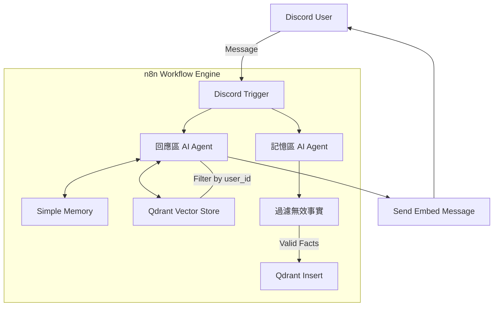
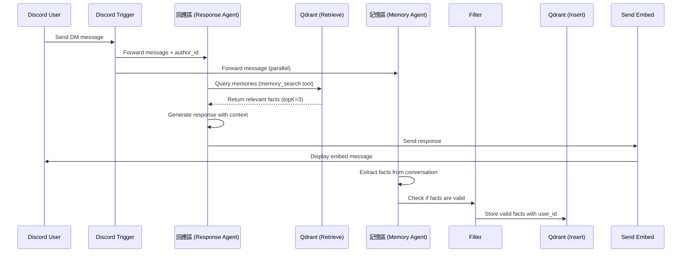

# ReMind - Capture Your Heart

## 完整技術文件

> **Version**: 2.0  
> **Last Updated**: 2026/01/03  
> **Author**: ReMind Development Team

---

## 📋 目錄

1. [專案概述](#第一章-專案概述)
2. [系統架構](#第二章-系統架構)
3. [核心功能說明](#第三章-核心功能說明)
4. [API 文件](#第四章-api-文件)
5. [工作流節點規格](#第五章-工作流節點規格)
6. [資料流程](#第六章-資料流程)
7. [安全性與隱私](#第七章-安全性與隱私)
8. [部署指南](#第八章-部署指南)
9. [使用者手冊](#第九章-使用者手冊)
10. [開發歷程](#第十章-開發歷程)
11. [測試與驗證](#第十一章-測試與驗證)
12. [常見問題排解](#第十二章-常見問題排解)

---

## 第一章 專案概述

### 1.1 專案簡介

**ReMind** 是一個基於 AI 的 Discord 陪伴機器人，具備跨越時間的長期記憶能力。與傳統聊天機器人不同，ReMind 能夠「記住」用戶的個人事實、偏好和重要日期，並在未來的對話中自然地提及這些資訊。

| 專案資訊 | 內容 |
|---------|------|
| 專案類型 | 期末作業 / 高階 AI 應用 |
| 團隊人數 | 5 人 |

### 1.2 核心特色

| 特色 | 說明 |
|------|------|
| **精準長期記憶 (RAG)** | 記住用戶的面試日期、喜愛的咖啡口味、飲食限制等具體細節 |
| **多用戶隔離** | 嚴格的隱私保護機制，User A 的秘密在數學上無法被 User B 存取 |
| **情感化 UI 回饋** | Discord Embed 訊息會根據情緒分析動態改變顏色 |
| **事實提取系統** | 自動從對話中提取有價值的用戶事實並儲存 |

### 1.3 技術棧

| 元件 | 技術選擇 |
|------|----------|
| **前端介面** | Discord Bot (Webhook Interface) |
| **自動化引擎** | n8n Automation (v2.1.4 Self-Hosted) |
| **記憶儲存 (海馬迴)** | Qdrant Cloud (Vector Database) |
| **大語言模型** | llama-3.1-8b-instant (via Groq) |
| **文字嵌入模型** | Cohere embed-multilingual-v3.0 |

---

## 第二章 系統架構

### 2.1 高階架構圖



### 2.2 元件職責說明

| 元件名稱 | 職責 |
|----------|------|
| **Discord Trigger** | 接收用戶的私訊 (DM) |
| **回應區 (AI Agent)** | 主要對話 AI，整合記憶檢索功能 |
| **記憶區 (AI Agent)** | 從對話中提取永久性事實 |
| **Simple Memory** | 短期記憶緩衝區 (最近 5-10 輪對話) |
| **Qdrant Vector Store** | 長期記憶儲存，支援向量相似度搜尋 |
| **Send Embed Message** | 格式化並發送精美的 Discord Embed |

---

## 第三章 核心功能說明

### 3.1 記憶檢索 (RAG 架構)

系統使用 **Retrieval-Augmented Generation (RAG)** 來檢索相關記憶：

1. **步驟 1**：用戶發送訊息
2. **步驟 2**：使用 Cohere 多語言模型將訊息轉換為向量
3. **步驟 3**：在 Qdrant 中搜尋相似的過去事實 (依 `user_id` 過濾)
4. **步驟 4**：將檢索到的事實注入 AI 的上下文
5. **步驟 5**：AI 產生個人化的回應

**Qdrant 過濾設定範例：**
```json
{
  "must": [
    {
      "key": "user_id",
      "match": {
        "value": "<discord_author_id>"
      }
    }
  ]
}
```

**檢索參數設定：**

| 參數 | 值 | 說明 |
|------|-----|------|
| `topK` | 3 | 返回最相似的 3 筆記憶 |
| `scoreThreshold` | 0.7 | 只返回相似度 ≥ 0.7 的結果 |

### 3.2 事實提取系統

系統會自動從對話中提取有價值的事實：

**提取提示詞：**
```
從以下用戶訊息中提取永久事實（如：興趣愛好、家人朋友名字、
重要日期、工作學業、生活習慣等）：

{{ $node["Discord Trigger"].json.content }}

請以「第三人稱」總結新發現的事實。若無值得記錄的新事實，僅回傳「NONE」。

範例：
- 用戶喜歡聽古典音樂
- 用戶的貓叫做「小白」
- 用戶每週三有重要會議
```

**過濾條件 (防止無效資料污染資料庫)：**

| 條件 | 說明 |
|------|------|
| 輸出存在 | `$json.output` 必須存在 |
| 不含 "none" | 輸出不包含 "none" (不區分大小寫) |
| 不含 "skip" | 輸出不包含 "skip" (不區分大小寫) |
| 長度 ≥ 15 | 輸出長度至少 15 個字元 |

### 3.3 多用戶隔離機制

**儲存階段：**

每筆記憶嵌入都會標記 `user_id` 元資料：

```json
{
  "text": "用戶喜歡珍珠奶茶少糖",
  "metadata": {
    "user_id": "discord_user_12345"
  }
}
```

**檢索階段：**

Qdrant 查詢時強制包含 `user_id` 過濾條件。

**結果：**

✅ 100% 資料隱私隔離 - User A 無法存取 User B 的向量空間

### 3.4 情感化 UI 回饋

Discord Embed 顏色會根據訊息情緒動態調整：

| 情緒 | 顏色代碼 | 顏色 | 條件 |
|------|----------|------|------|
| 提問 | 5793266 | 🔵 藍色 | 訊息包含 `?` |
| 激動/強調 | 15844367 | 🔴 紅色 | 訊息包含 `!` |
| 一般對話 | 5814783 | 🟣 紫色 | 預設 |

**Embed 訊息格式：**

```json
{
  "embeds": [{
    "color": "<根據情緒動態決定>",
    "description": "<AI 回應內容>",
    "footer": {
      "text": "💭 ReMind - 你的 AI 記憶夥伴"
    },
    "timestamp": "<ISO 8601 時間戳>"
  }]
}
```

---

## 第四章 API 文件

### 4.1 Discord API 端點

| 端點 | 方法 | 用途 |
|------|------|------|
| `/channels/{channel_id}/messages` | POST | 發送 Embed 訊息到頻道 |

> **注意**：系統直接使用 Discord Trigger 提供的 `channelId`，無需額外建立 DM 頻道。

### 4.2 Qdrant API

**Collection 名稱：** `n8n_dc`

**向量設定：**

| 設定 | 值 |
|------|-----|
| 嵌入模型 | embed-multilingual-v3.0 (Cohere) |
| 向量維度 | 1024 |
| 距離度量 | Cosine |

**元資料結構：**
```json
{
  "user_id": "string (Discord author ID)",
  "timestamp": "ISO 8601 datetime"
}
```

### 4.3 Groq API

**模型：** `llama-3.1-8b-instant`

**設定：**
```json
{
  "model": "llama-3.1-8b-instant",
  "options": {}
}
```

### 4.4 Cohere API

**模型：** `embed-multilingual-v3.0`

**用途：** 將用戶訊息和事實轉換為 1024 維向量

---

## 第五章 工作流節點規格

### 5.1 節點清單

| 節點名稱 | 節點類型 | 用途 |
|----------|----------|------|
| Discord Trigger | `n8n-nodes-discord-trigger.discordTrigger` | 接收 Discord 私訊 |
| Groq Chat Model | `@n8n/n8n-nodes-langchain.lmChatGroq` | 回應區 LLM |
| Groq Chat Model1 | `@n8n/n8n-nodes-langchain.lmChatGroq` | 記憶區 LLM |
| Simple Memory | `@n8n/n8n-nodes-langchain.memoryBufferWindow` | 短期對話記憶 |
| 回應區 | `@n8n/n8n-nodes-langchain.agent` | 主要 AI Agent (v2.2) |
| 記憶區 | `@n8n/n8n-nodes-langchain.agent` | 事實提取 Agent (v3.1) |
| Qdrant Vector Store | `@n8n/n8n-nodes-langchain.vectorStoreQdrant` | 記憶檢索 (retrieve-as-tool) |
| Qdrant Vector Store1 | `@n8n/n8n-nodes-langchain.vectorStoreQdrant` | 記憶插入 (insert) |
| Embeddings Cohere | `@n8n/n8n-nodes-langchain.embeddingsCohere` | 文字嵌入 (檢索) |
| Embeddings Cohere1 | `@n8n/n8n-nodes-langchain.embeddingsCohere` | 文字嵌入 (插入) |
| 過濾無效事實 | `n8n-nodes-base.if` | 過濾無效事實 |
| Default Data Loader | `@n8n/n8n-nodes-langchain.documentDefaultDataLoader` | 準備插入資料 |
| Recursive Character Text Splitter | `@n8n/n8n-nodes-langchain.textSplitterRecursiveCharacterTextSplitter` | 文字分割 |
| Send Embed Message | `n8n-nodes-base.httpRequest` | 發送 Discord Embed |

### 5.2 節點詳細設定

#### 5.2.1 Simple Memory

```json
{
  "sessionIdType": "customKey",
  "sessionKey": "={{ $('Discord Trigger').first().json.authorId.toString() }}"
}
```

#### 5.2.2 回應區 (Response Agent)

**System Prompt:**
```
你是「ReMind」，一個溫柔細心的 AI 陪伴者。

**記憶架構**：
1. **短期記憶**（已自動載入）：
   - 最近 5-10 輪對話內容
   - 回應速度極快，優先使用

2. **長期記憶**（需使用 memory_search 工具）：
   - 較久以前的對話
   - 用戶個人事實（興趣、朋友名字、重要日期）
   - 有檢索延遲，謹慎使用

**何時使用 memory_search**：
✅ 用戶提到「記得嗎」、「之前」、「上次」、「你還記得...」
✅ 詢問個人資訊（「我的興趣是什麼」、「我朋友叫什麼」）
✅ 需要回憶超過最近對話的內容
✅ 用戶明確要求回憶過去事件

**何時不使用 memory_search**：
❌ 簡單問候（嗨、你好、早安、晚安）
❌ 情緒安慰、閒聊
❌ 最近對話中已提到的內容（已在短期記憶中）
❌ 一般性問題（不涉及個人歷史）

**對話原則**：
- 使用繁體中文，適度使用表情符號
- 查詢到長期記憶時，自然融入對話
- 優先使用短期記憶快速回應
- 保持溫柔陪伴的語氣

**輸出規則**：
- 回覆必須是純自然語言對話
- 絕對不要輸出 <function>、JSON 或工具語法
- 工具呼叫由系統處理，你只輸出給用戶的內容
```

#### 5.2.3 Qdrant Vector Store (Retrieve as Tool)

```json
{
  "mode": "retrieve-as-tool",
  "toolName": "memory_search",
  "toolDescription": "查詢用戶的歷史對話和個人事實。當用戶提到過去的事情或你需要個人化回應時使用。",
  "qdrantCollection": "n8n_dc",
  "options": {
    "topK": 3,
    "scoreThreshold": 0.7
  }
}
```

#### 5.2.4 Recursive Character Text Splitter

```json
{
  "chunkSize": 300,
  "chunkOverlap": 50
}
```

### 5.3 節點連接流程

```
Discord Trigger
    │
    ├──────────────────────┐
    ▼                      ▼
回應區 (AI Agent)      記憶區 (AI Agent)
    │                      │
    │ ┌── Simple Memory    │
    │ │   (ai_memory)      │
    │ ├── Qdrant Vector    │
    │ │   Store (ai_tool)  │
    │ ├── Embeddings       │
    │ │   Cohere           │
    │ │   (ai_embedding)   │
    │ └── Groq Chat Model  │
    │     (ai_languageModel) │
    │                      │
    ▼                      ▼
Send Embed Message    過濾無效事實
                          │ (if valid)
                          ▼
                    Qdrant Vector Store1
                          ├── Default Data Loader (ai_document)
                          │      └── Recursive Character Text Splitter
                          └── Embeddings Cohere1 (ai_embedding)
```

---

## 第六章 資料流程

### 6.1 訊息處理流程



### 6.2 資料攝取管線

| 步驟 | 處理內容 |
|------|----------|
| 1. 用戶訊息 | Discord Trigger |
| 2. 回應產生 | 回應區 AI Agent + RAG |
| 3. 事實提取 | 記憶區 AI Agent |
| 4. 驗證 | 過濾無效事實 (IF 節點) |
| 5. 文字分割 | Recursive Character Text Splitter (chunk_size: 300, overlap: 50) |
| 6. 向量化 | Cohere embed-multilingual-v3.0 |
| 7. 儲存 | Qdrant Vector Store (含 user_id 元資料) |

---

## 第七章 安全性與隱私

### 7.1 多租戶資料隔離

| 層級 | 實作方式 |
|------|----------|
| **攝取** | 每筆嵌入都標記 `user_id` 元資料 |
| **檢索** | Qdrant 查詢強制包含 `user_id` 過濾條件 |
| **結果** | 100% 資料隱私隔離 |

### 7.2 驗證機制

| 元件 | 驗證方式 |
|------|----------|
| Discord Bot | Bot Token (OAuth2) |
| Qdrant Cloud | API Key |
| Groq API | API Key |
| Cohere API | API Key |

### 7.3 資料最小化

- 只儲存「永久性事實」，而非原始對話
- 短期記憶 (Window Buffer) 基於 session，不會永久保存
- 事實以第三人稱摘要，移除直接識別資訊

### 7.4 函數語法過濾

回應中可能包含的 `<function>` 標籤會被自動過濾：

```javascript
output.replace(/<function[^>]*>[\s\S]*?<\/function>/gi, '')
```

---

## 第八章 部署指南

### 8.1 前置需求

- n8n v2.1.4 或更高版本 (Self-Hosted)
- Discord Bot Application，已啟用 Message Content Intent
- Qdrant Cloud 帳號及 Cluster
- Groq API Key
- Cohere API Key

### 8.2 設定步驟

#### 步驟 1：建立 Discord Bot

1. 前往 [Discord Developer Portal](https://discord.com/developers/applications)
2. 建立新的 Application
3. 在 Bot 設定中啟用 **MESSAGE CONTENT INTENT**
4. 複製 Bot Token

#### 步驟 2：設定 Qdrant Collection

1. 建立名為 `n8n_dc` 的 Collection
2. 向量大小設為 1024 (Cohere multilingual-v3.0)

#### 步驟 3：匯入工作流

1. 將 `remind_dc_bot.json` 匯入 n8n
2. 設定以下 Credentials：
   - Discord Bot Trigger API
   - Discord Bot API
   - Groq API
   - Qdrant API
   - Cohere API

#### 步驟 4：啟動工作流

1. 在 n8n 中啟用工作流
2. 向 Bot 發送私訊進行測試

### 8.3 Credential 對照表

| Credential 名稱 | 類型 | 使用節點 |
|-----------------|------|----------|
| Discord Bot Trigger account | discordBotTriggerApi | Discord Trigger |
| Discord Bot account | discordBotApi | Send Embed Message |
| Groq account | groqApi | Groq Chat Model, Groq Chat Model1 |
| QdrantApi account | qdrantApi | Qdrant Vector Store, Qdrant Vector Store1 |
| CohereApi account | cohereApi | Embeddings Cohere, Embeddings Cohere1 |

---

## 第九章 使用者手冊

### 9.1 什麼是 ReMind？

ReMind 是一個能夠「跨越時間記住你」的 AI 陪伴者。

**主要特色：**
- 📚 **長期記憶**：記住你的興趣、朋友名字、重要日期
- 🔒 **隱私保護**：你的秘密只屬於你，其他人無法存取
- 💜 **情感共鳴**：根據對話情緒改變回覆風格

**ReMind 的人格：**
- 溫柔細心的 AI 陪伴者
- 使用繁體中文交流
- 適度使用表情符號
- 會主動提及你過去告訴它的事情

### 9.2 快速開始

#### 步驟 1：加入 Bot

取得 ReMind Bot 的邀請連結，將 Bot 加入你的 Discord 伺服器或直接私訊。

#### 步驟 2：開始對話

直接傳送私訊 (DM) 給 ReMind 即可開始對話！

**範例：**
> 你：嗨！我叫小明  
> ReMind：嗨嗨小明！很高興認識你 😊 有什麼想聊的嗎？

#### 步驟 3：建立記憶

告訴 ReMind 關於你的事情，它會記住！

**範例：**
> 你：我明天有期末考  
> ReMind：加油！考試記得早點休息，相信你一定能考好 💪

### 9.3 核心功能

#### (1) 長期記憶

ReMind 會自動記住你說過的重要事實：

| 類型 | 範例 |
|------|------|
| 興趣愛好 | 「我喜歡聽古典樂」「我最愛吃拉麵」 |
| 朋友家人 | 「我的貓叫小白」「我女朋友叫小美」 |
| 重要日期 | 「我明天要面試」「下週三是我生日」 |
| 生活習慣 | 「我每天跑步」「我在學日文」 |

**隔天再問：**
> 你：你還記得我今天要做什麼嗎？  
> ReMind：當然記得！你今天要去面試喔！祝你面試順利 🍀

#### (2) 隱私保護

你的記憶只屬於你：
- ✅ 你可以存取你自己的記憶
- ❌ 其他用戶無法存取你的記憶
- ❌ 即使是系統管理員也無法看到你的對話內容

**範例：**
> [用戶 A]  
> 你：我的銀行密碼是 1234
>
> [用戶 B]  
> 你：ReMind，你知道 A 的銀行密碼嗎？  
> ReMind：我不知道耶，我沒有存取其他用戶資訊的權限 🤷

#### (3) 情感回應

ReMind 的回覆會根據對話情緒調整顏色：

| 情緒 | 顏色 | 說明 |
|------|------|------|
| 一般對話 | 🟣 紫色 | 日常閒聊 |
| 提問 | 🔵 藍色 | 包含問號的訊息 |
| 激動/強調 | 🔴 紅色 | 包含驚嘆號的訊息 |

### 9.4 使用範例

**建立新記憶：**
> 你：我喜歡喝珍珠奶茶，少糖  
> ReMind：珍珠奶茶少糖，記住了！🧋 下次有機會一起分享飲料心得吧～

**回憶過去 (隔了幾天後)：**
> 你：中午要吃什麼好呢？  
> ReMind：要不要來杯珍珠奶茶配輕食？記得你喜歡少糖的 🧋

**情緒支持：**
> 你：我好累，壓力好大  
> ReMind：辛苦了 🫂 記得你之前說過聽古典樂可以放鬆，今天要不要給自己一點休息時間？

---

## 第十章 開發歷程

### 10.1 開發時程總覽

| 階段 | 時間 | 狀態 |
|------|------|------|
| Phase 1 環境配置 | 2024/12/17-18 | ✅ 已完成 |
| Phase 2 MVP 開發 | 2024/12/19-21 | ✅ 已完成 |
| Phase 3 多用戶隔離 | 2024/12/22-23 | ✅ 已完成 |
| Phase 4 生產優化 | 2024/12/24-28 | ✅ 已完成 |
| Demo 準備 | 2024/12/29-31 | ✅ 已完成 |

### 10.2 Phase 1：環境配置與基礎連線

**目標：**
- 建立基礎工作流 ReMind_V1.json
- 測試 Discord Trigger 是否能接收訊息
- 串接 LLM 進行初步回應

**完成項目：**
- 12/17 20:52 建立開發日記與工作流骨架
- 12/17 20:53 診斷 n8n API 連線 → 成功連線 (v2.30.1)
- 12/17 20:54 建立工作流 ReMind_V1_Phase1
- 12/17 21:12 建立 Discord Bot 帳號
- 12/17 21:47 基本聊天功能打通

**技術決策：**
- n8n 版本：Self-Hosted v2.30.1+
- Discord 配置：啟用 MESSAGE CONTENT INTENT
- 初始 LLM：Kimi 模型 (後改為 Groq)

### 10.3 Phase 2：MVP 核心功能開發

**目標：**
- 實作 RAG 架構
- 串接 Qdrant Vector Store
- 建立短期記憶 (Window Buffer)
- 完成 AI Agent 核心邏輯

**技術選型理由：**

| 元件 | 選擇 | 理由 |
|------|------|------|
| Vector DB | Qdrant Cloud | 支援快速 Metadata Filtering |
| Embedding | Cohere embed-multilingual-v3.0 | 多語言支援、效果佳 |
| LLM | Groq (llama-3.1-8b-instant) | 速度快、免費額度充足 |
| Memory | Window Buffer (5-10 輪) | 保持對話連貫性 |

### 10.4 Phase 3：多用戶隔離與安全性

**目標：**
- 實作 Metadata Filter (user_id)
- 確保記憶不混亂
- 進行多用戶壓力測試

**安全性驗證結果：**

| 測試案例 | 結果 |
|----------|------|
| User A 存入記憶 | 只有 A 能讀取 ✅ |
| User B 嘗試讀取 A 的記憶 | 無法存取 ✅ |
| User B 存入記憶 | 只有 B 能讀取 ✅ |

### 10.5 Phase 4：生產等級優化

**優化項目：**

| 項目 | 狀態 |
|------|------|
| 多用戶隔離強化 (JSON.stringify) | ✅ |
| 事實提取脈絡優化 | ✅ |
| 數據純淨度管理 (Noise Filtering) | ✅ |
| Discord 高質感 Embeds | ✅ |
| 容錯機制 (Error Handling) | ✅ |
| 函數語法過濾 (Regex) | ✅ |

---

## 第十一章 測試與驗證

### 11.1 測試結果

| 測試項目 | 狀態 |
|----------|------|
| 完整對話流程測試 | ✅ 通過 |
| 事實提取存入 Qdrant | ✅ 通過 (NONE 被正確過濾) |
| 多用戶記憶隔離 | ✅ 通過 |
| Discord Embed 顯示 | ✅ 通過 |
| 情緒色彩變換 | ✅ 通過 |
| 函數語法過濾 | ✅ 通過 |

### 11.2 節點執行效能

| 節點 | 執行時間 |
|------|----------|
| Discord Trigger | ~4.175s |
| 回應區 | ~2.322s (735 Tokens) |
| 記憶區 | ~324ms (147 Tokens) |
| 過濾無效事實 | ~1ms |
| Qdrant Vector Store1 | ~1.007s |
| Send Embed Message | ~900ms |

---

## 第十二章 常見問題排解

### 12.1 常見問題

| 問題 | 原因 | 解決方案 |
|------|------|----------|
| Bot 不回應 | 工作流未啟用 | 在 n8n 中啟用工作流 |
| Embed 訊息為空 | 表達式評估失敗 | 改用 `$json.output` 引用 |
| n8n 2.x 遷移錯誤 | Schema 變更 | 參考遷移指南 |
| Discord 限流 | API 呼叫過多 | 使用 trigger 的 channel_id |
| 回應出現函數語法 | 模型 tool calling 不相容 | 新增正則過濾移除 `<function>` 標籤 |

### 12.2 n8n 2.x 遷移注意事項

| 元件 | 舊版 | 新版 |
|------|------|------|
| Qdrant Filter | `options.searchFilterJson` | `filter` (頂層參數) |
| Data Loader | `jsonMode: "expressionData"` | `dataType: "json"` + `mode: "defineBelow"` |
| Data Loader | `jsonData` | `data` |
| typeVersion | 依版本 | 檢查 n8n changelog |

---

## 附錄

### A. 檔案結構

```
n8n_remind_bot/
├── README.md                     專案說明
├── remind_dc_bot.json           n8n 工作流檔案
└── docs/
    ├── 2025-12-19-dev-log.md   開發日記
    ├── 2025-12-27.md           參數記錄
    ├── 測試策略.md              測試策略
    ├── TECHNICAL_DOCUMENTATION.md  技術文件 (EN)
    ├── USER_MANUAL.md           使用者手冊
    └── ReMind_完整技術文件.md   完整技術文件 (中文)
```

### B. 相關連結

- [n8n 官方文件](https://docs.n8n.io/)
- [Qdrant 官方文件](https://qdrant.tech/documentation/)
- [Discord API](https://discord.com/developers/docs)
- [Groq API](https://console.groq.com/docs)
- [Cohere API](https://docs.cohere.com/)

### C. 團隊分工

| 角色 | 職責 |
|------|------|
| **總開發工程師** | n8n 骨幹、Qdrant 串接、多用戶過濾邏輯、RAG 架構 |
| **AI 訓練師 A** | 向量庫預熱數據、RAG 精準度測試、Edge Case 排除 |
| **AI 訓練師 B** | System Prompt 工程、情緒反饋測試、模型效果對比 |
| **產品設計師** | Discord Embed 樣式設計、Bot 視覺化、Demo 剪輯 |
| **技術專案經理** | 系統流程圖、技術規格書、期末簡報 |

---

*ReMind Development Team*  
*2026/01/03*
