# ReMind - Capture Your Heart

## Technical Documentation

> **Version**: 1.0  
> **Last Updated**: 2026/01/01  
> **Author**: ReMind Development Team

---

## 📋 Table of Contents

1. [Project Overview](#1-project-overview)
2. [System Architecture](#2-system-architecture)
3. [Core Functionalities](#3-core-functionalities)
4. [API Documentation](#4-api-documentation)
5. [Workflow Node Specifications](#5-workflow-node-specifications)
6. [Data Flow](#6-data-flow)
7. [Security & Privacy](#7-security--privacy)
8. [Deployment Guide](#8-deployment-guide)
9. [Troubleshooting](#9-troubleshooting)

---

## 1. Project Overview

### 1.1 Introduction

**ReMind** is an AI-powered companion bot for Discord that provides deep emotional connections through long-term memory capabilities. Unlike traditional chatbots, ReMind can "remember" users' personal facts, preferences, and important dates across conversations.

### 1.2 Key Features

| Feature | Description |
|---------|-------------|
| **Precision Long-term Memory (RAG)** | Recalls specific details like interview dates, favorite coffee, dietary restrictions |
| **Multi-User Isolation** | Strict privacy - User A's secrets are mathematically inaccessible to User B |
| **Emotional UI Feedback** | Dynamic Discord Embeds that change color based on sentiment analysis |
| **Fact Extraction System** | Automatically extracts and stores user facts for future recall |

### 1.3 Technology Stack

| Component | Technology |
|-----------|------------|
| **Frontend** | Discord Bot (Webhook Interface) |
| **Orchestrator** | n8n Automation (v2.1.4 Self-Hosted) |
| **Memory (Hippocampus)** | Qdrant Cloud (Vector Database) |
| **LLM** | openai/gpt-oss-120b (via Groq) |
| **Embedding Model** | Cohere embed-multilingual-v3.0 |

---

## 2. System Architecture

### 2.1 High-Level Architecture Diagram

```mermaid
graph TD
    User[Discord User] -->|Message| DBot[Discord Trigger]
    
    subgraph n8n["n8n Workflow Engine"]
        DBot --> Agent[回應區 AI Agent]
        Agent <--> Memory[Simple Memory]
        Agent <--> VectorDB[(Qdrant Vector Store)]
        Agent --> FactAgent[記憶區 AI Agent]
        FactAgent --> Filter[過濾無效事實]
        Filter -->|Valid Facts| VectorDB1[(Qdrant Insert)]
    end
    
    Agent --> Embed[Send Embed Message]
    Embed --> User
    
    VectorDB ---|Filter by user_id| Agent
```



### 2.2 Component Responsibilities

| Component | Responsibility |
|-----------|----------------|
| **Discord Trigger** | Receives incoming DM messages from users |
| **回應區 (Response Agent)** | Main conversational AI with memory retrieval |
| **記憶區 (Memory Agent)** | Extracts permanent facts from conversations |
| **Simple Memory** | Short-term buffer (last 5-10 conversation turns) |
| **Qdrant Vector Store** | Long-term memory storage with vector similarity search |
| **Send Embed Message** | Formats and sends beautiful Discord embeds |

---

## 3. Core Functionalities

### 3.1 Memory Retrieval (RAG)

The system uses **Retrieval-Augmented Generation (RAG)** to fetch relevant memories:

1. User sends a message
2. Message is embedded using Cohere's multilingual model
3. Qdrant searches for similar past facts (filtered by `user_id`)
4. Retrieved facts are injected into the AI's context
5. AI generates a personalized response

**Qdrant Filter Configuration:**
```json
{
  "must": [
    {
      "key": "user_id",
      "match": {
        "value": "<discord_author_id>"
      }
    }
  ]
}
```

### 3.2 Fact Extraction

The system automatically extracts valuable facts from conversations:

**Extraction Prompt:**
```
從以下用戶訊息中提取永久事實（如：興趣愛好、家人朋友名字、重要日期、工作學業、生活習慣等）：

{{ user_message }}

請以「第三人稱」總結新發現的事實。若無值得記錄的新事實，僅回傳「NONE」。

範例：
- 用戶喜歡聽古典樂
- 用戶的貓叫做「小白」
- 用戶每週三有重要會議
```

**Filtering Logic:**
```javascript
// Only store facts that are:
// 1. Not empty
// 2. Not containing "NONE" or "SKIP"
// 3. At least 5 characters long
conditions: [
  { value1: "{{ $json.output }}", operation: "exists" },
  { value1: "{{ $json.output.toLowerCase() }}", operation: "notContains", value2: "none" },
  { value1: "{{ $json.output.toLowerCase() }}", operation: "notContains", value2: "skip" },
  { value1: "{{ $json.output.length }}", operation: "largerEqual", value2: 5 }
]
```

### 3.3 Multi-User Isolation

Every memory embedding is tagged with a `user_id` during ingestion:

```json
{
  "dataType": "json",
  "mode": "defineBelow",
  "data": "={{ { text: $json.output, metadata: { user_id: $('Discord Trigger').first().json.authorId.toString() } } }}"
}
```

During retrieval, the filter ensures only the current user's memories are accessed.

### 3.4 Emotional UI Feedback

Discord embed colors change based on message sentiment:

```javascript
// Color logic in Send Embed Message node
color: 
  output.includes('?') ? 5793266  // Blue for questions
  : output.includes('!') ? 15844367  // Red for excitement
  : 5814783  // Default purple
```

---

## 4. API Documentation

### 4.1 Discord API Endpoints Used

| Endpoint | Method | Purpose |
|----------|--------|---------|
| `/users/@me/channels` | POST | Create DM channel with user |
| `/channels/{channel_id}/messages` | POST | Send embed message to channel |

### 4.2 Qdrant API

**Collection Name:** `n8n_dc_bot`

**Vector Configuration:**
- Embedding Model: `embed-multilingual-v3.0` (Cohere)
- Vector Dimension: 1024
- Distance Metric: Cosine

**Metadata Schema:**
```json
{
  "user_id": "string (Discord author ID)",
  "timestamp": "ISO 8601 datetime"
}
```

### 4.3 Groq API

**Model:** `openai/gpt-oss-120b`

**Configuration:**
```json
{
  "model": "openai/gpt-oss-120b",
  "options": {}
}
```

---

## 5. Workflow Node Specifications

### 5.1 Node Overview

| Node Name | Node Type | Purpose |
|-----------|-----------|---------|
| Discord Trigger | `n8n-nodes-discord-trigger.discordTrigger` | Webhook for Discord DMs |
| Groq Chat Model | `@n8n/n8n-nodes-langchain.lmChatGroq` | LLM for response generation |
| Simple Memory | `@n8n/n8n-nodes-langchain.memoryBufferWindow` | Short-term conversation buffer |
| 回應區 | `@n8n/n8n-nodes-langchain.agent` | Main AI Agent (Response) |
| 記憶區 | `@n8n/n8n-nodes-langchain.agent` | Fact Extraction Agent |
| Qdrant Vector Store | `@n8n/n8n-nodes-langchain.vectorStoreQdrant` | Memory retrieval |
| Qdrant Vector Store1 | `@n8n/n8n-nodes-langchain.vectorStoreQdrant` | Memory insertion |
| Embeddings Cohere | `@n8n/n8n-nodes-langchain.embeddingsCohere` | Text embedding |
| 過濾無效事實 | `n8n-nodes-base.if` | Filter invalid facts |
| Default Data Loader | `@n8n/n8n-nodes-langchain.documentDefaultDataLoader` | Prepare data for insertion |
| Recursive Character Text Splitter | `@n8n/n8n-nodes-langchain.textSplitterRecursiveCharacterTextSplitter` | Split long texts |
| Send Embed Message | `n8n-nodes-base.httpRequest` | Send Discord embed |

### 5.2 Node Connection Flow

```
Discord Trigger
    │
    ▼
回應區 (AI Agent) ──────────────────┐
    │       │                       │
    │       ├─→ Simple Memory       │
    │       ├─→ Qdrant Vector Store │
    │       └─→ Embeddings Cohere   │
    │                               │
    ├─────────────────────┐         │
    ▼                     ▼         ▼
記憶區               Send Embed Message
    │
    ▼
過濾無效事實
    │ (if valid)
    ▼
Qdrant Vector Store1 ◄── Default Data Loader ◄── Embeddings Cohere1
                                   ▲
                                   │
                     Recursive Character Text Splitter
```

---

## 6. Data Flow

### 6.1 Message Processing Flow

```mermaid
sequenceDiagram
    participant U as Discord User
    participant D as Discord Trigger
    participant R as 回應區 (Response Agent)
    participant Q as Qdrant (Retrieve)
    participant M as 記憶區 (Memory Agent)
    participant F as Filter
    participant Q1 as Qdrant (Insert)
    participant E as Send Embed

    U->>D: Send DM message
    D->>R: Forward message + author_id
    R->>Q: Query memories (filtered by user_id)
    Q-->>R: Return relevant facts
    R->>R: Generate response with context
    R->>E: Send response
    E->>U: Display embed message
    R->>M: Extract facts from conversation
    M->>F: Check if facts are valid
    F->>Q1: Store valid facts with user_id
```



### 6.2 Data Ingestion Pipeline

1. **User Message** → Discord Trigger
2. **Response Generation** → 回應區 with RAG
3. **Fact Extraction** → 記憶區 AI Agent
4. **Validation** → 過濾無效事實 (Filter)
5. **Text Splitting** → Recursive Character Text Splitter (chunk_size: 500, overlap: 50)
6. **Embedding** → Cohere embed-multilingual-v3.0
7. **Storage** → Qdrant Vector Store (with user_id metadata)

---

## 7. Security & Privacy

### 7.1 Multi-Tenant Data Isolation

| Layer | Implementation |
|-------|----------------|
| **Ingestion** | Every embedding is tagged with `user_id` metadata |
| **Retrieval** | Qdrant queries include mandatory `user_id` filter |
| **Result** | 100% data privacy isolation - User A cannot access User B's vector space |

### 7.2 Authentication

| Component | Authentication Method |
|-----------|----------------------|
| Discord Bot | Bot Token (OAuth2) |
| Qdrant Cloud | API Key |
| Groq API | API Key |
| Cohere API | API Key |

### 7.3 Data Minimization

- Only **permanent facts** are stored (not raw conversations)
- Short-term memory (Window Buffer) is session-based and not persisted
- Facts are summarized in third-person to remove direct identifiers

---

## 8. Deployment Guide

### 8.1 Prerequisites

- n8n v2.1.4 or higher (Self-Hosted)
- Discord Bot Application with Message Content Intent enabled
- Qdrant Cloud account with a cluster
- Groq API key
- Cohere API key

### 8.2 Setup Steps

1. **Create Discord Bot**
   - Go to [Discord Developer Portal](https://discord.com/developers/applications)
   - Create new application
   - Enable **MESSAGE CONTENT INTENT** under Bot settings
   - Copy Bot Token

2. **Setup Qdrant Collection**
   - Create a collection named `n8n_dc_bot`
   - Vector size: 1024 (Cohere multilingual-v3.0)

3. **Import Workflow**
   - Import `remind_dc_bot.json` into n8n
   - Configure credentials:
     - Discord Bot Trigger API
     - Discord Bot API
     - Groq API
     - Qdrant API
     - Cohere API

4. **Activate Workflow**
   - Enable the workflow in n8n
   - Test by sending a DM to the bot

### 8.3 Credential Reference

| Credential Name | Type | Used By |
|-----------------|------|---------|
| Discord Bot Trigger account 2 | discordBotTriggerApi | Discord Trigger |
| Discord Bot account 2 | discordBotApi | Create DM Channel, Send Embed Message |
| Groq account | groqApi | Groq Chat Model, Groq Chat Model1 |
| QdrantApi account | qdrantApi | Qdrant Vector Store, Qdrant Vector Store1 |
| CohereApi account | cohereApi | Embeddings Cohere, Embeddings Cohere1 |

---

## 9. Troubleshooting

### 9.1 Common Issues

| Issue | Cause | Solution |
|-------|-------|----------|
| Bot not responding | Workflow not active | Activate workflow in n8n |
| Empty embed message | Expression evaluation failed | Use `$json.output` instead of `$node["name"].json.output` |
| n8n 2.x migration errors | Schema changes | See migration guide in dev logs |
| Discord rate limit | Too many API calls | Use channel_id from trigger instead of creating DM channel |
| Function syntax in response | Model tool calling incompatibility | Add regex filter to remove `<function>` tags |

### 9.2 n8n 2.x Migration Notes

Key breaking changes when upgrading to n8n 2.x:

| Component | Old | New |
|-----------|-----|-----|
| Qdrant Filter | `options.searchFilterJson` | `filter` (top-level) |
| Data Loader | `jsonMode: "expressionData"` | `dataType: "json"` + `mode: "defineBelow"` |
| Data Loader | `jsonData` | `data` |
| typeVersion | Various | Check n8n changelog |

---

## Appendix A: Workflow JSON

The complete workflow is available in `remind_dc_bot.json`.

## Appendix B: Development Logs

- `docs/2025-12-19-dev-log.md` - Initial development and Phase 1-4 implementation
- `docs/2025-12-27.md` - n8n 2.x migration and parameter documentation

---

*Document generated by ReMind Development Team*
