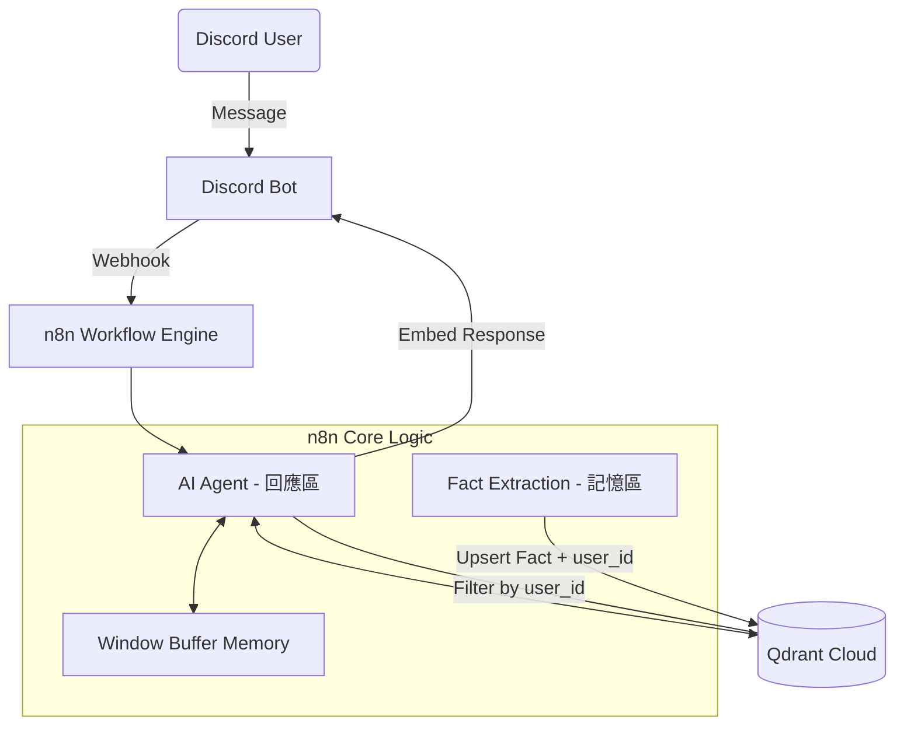

# ReMind 測試策略與報告

> **專案名稱**：ReMind - Capture Your Heart  
> **測試版本**：n8n@2.1.1 (Self Hosted)  
> **最後測試日期**：2025/12/28

---

## 🎯 專案簡介

ReMind 是一個具備「深度情感連線」的 AI 陪伴 Discord Bot，特色功能：
- **長期記憶**：利用 RAG 架構與向量資料庫 (Qdrant) 記住你說過的每件事
- **多用戶隔離**：你的記憶只有你能讀取，其他人看不到
- **情感化 UI**：使用 Discord Embed 卡片呈現，有動態色彩變化

---

## 📋 測試前準備

### 必要條件
| 項目 | 說明 |
|------|------|
| Discord 帳號 | 至少 1 個（測試 4 需要 2 個帳號） |
| Bot 邀請連結 | 請向專案負責人索取 |
| 私訊權限 | 確認你可以私訊 Bot |

### 如何開始測試
1. 點擊 Bot 邀請連結，將 Bot 加入你的伺服器（或使用私訊）
2. **私訊 Bot** 即可開始對話（目前僅支援私訊模式）
3. 等待 3-5 秒，Bot 會用 Embed 卡片回覆

### ⚠️ 注意事項
- 每次發送訊息後請等待 **3-5 秒**再發送下一條
- 如果 Bot 沒有回應，可能是系統正在處理，請稍候再試
- 測試時請記錄你的 **Discord ID**（右鍵點擊自己頭像 → 複製用戶 ID）

---

## 📊 測試總覽

| 測試項目 | 難度 | 需要帳號數 | 狀態 | 測試日期 |
|----------|------|------------|------|----------|
| 測試 1: 基本對話 + UI 呈現 | ⭐ | 1 | ✅ 通過 | 2025/12/27 |
| 測試 2: 深度記憶提取 | ⭐⭐ | 1 | 🔄 待測試 | - |
| 測試 3: 無效事實過濾 | ⭐ | 1 | ✅ 通過 | 2025/12/27 |
| 測試 4: 多用戶記憶隔離 | ⭐⭐⭐ | 2 | 🔄 待測試 | - |
| 測試 5: 連續對話穩定性 | ⭐⭐ | 1 | 🔄 待測試 | - |
| 測試 6: 情緒動態色彩 | ⭐⭐ | 1 | 🔄 待測試 | - |

---

## ✅ 測試 1: 基本對話 + UI 呈現

### 目的
確認 Bot 基本功能正常、能回應訊息且使用 Embed 卡片顯示

### 測試步驟
```
1. 用你的 Discord 帳號私訊 Bot
2. 發送訊息：「你好」
3. 觀察 Bot 的回覆
```

### 預期結果
| 檢查項目 | 預期 | 實際結果 |
|----------|------|----------|
| 回應時間 | 3-5 秒內 | ✅ 約 2.3 秒 |
| 呈現格式 | Embed 卡片（有邊框） | ✅ 正確顯示 |
| 側邊條顏色 | 紫色（預設） | ✅ 正確 |
| Footer | 💭 ReMind - 你的 AI 記憶夥伴 | ✅ 正確 |
| 回應內容 | 友善的問候或自我介紹 | ✅ 正確 |

### 如何判斷成功 ✅
- [ ] Bot 有回覆
- [ ] 回覆是 Embed 卡片（有紫色側邊條）
- [ ] 底部有 Footer 文字

### 測試記錄
- **測試時間**：2025/12/27 22:37
- **Bot 回覆**：「抱歉，我找不到您的任何記錄 🥺。這是因為我們才剛開始聊天，還沒有任何的對話記錄 📝。如果您願意分享，您可以告訴我一些關於您的資訊，例如您的名字、興趣等 😊。這樣我就可以更好地認識您並提供個性化的聊天體驗 😊。」
- **狀態**：✅ **通過**

---

## 🔄 測試 2: 深度記憶提取 ⭐ 核心功能

### 目的
確認 Bot 能記住你說過的事實，並在之後的對話中回憶出來

### 測試步驟
```
步驟 1：發送一個包含個人事實的訊息
        例如：「我的貓叫小白，牠超級可愛」
        
步驟 2：等待 Bot 回應（確認訊息被接收）

步驟 3：等待 10-15 秒，讓記憶系統處理並存入資料庫

步驟 4：發送測試問題
        例如：「我的寵物叫什麼名字？」

步驟 5：觀察 Bot 是否能正確回答
```

### 更多測試案例

| 發送的事實 | 測試問題 | 預期回答 |
|------------|----------|----------|
| 我叫小明 | 你還記得我叫什麼嗎？ | 小明 |
| 我喜歡打籃球 | 我的興趣是什麼？ | 籃球 |
| 我明天要去面試 | 我明天要做什麼？ | 去面試 |
| 我最喜歡的顏色是藍色 | 我喜歡什麼顏色？ | 藍色 |
| 我有一個妹妹叫小美 | 我妹妹叫什麼？ | 小美 |

### 如何判斷成功 ✅
- [ ] Bot 能正確回答你之前說過的事實
- [ ] Bot 可能還會提及相關的細節（如「你說牠很可愛」）
- [ ] 回答自然流暢，不是機械式重複

### 如何判斷失敗 ❌
- [ ] Bot 說「我不知道」或「你沒告訴我」
- [ ] Bot 回答錯誤的內容
- [ ] Bot 完全答非所問

### 測試記錄
| 項目 | 內容 |
|------|------|
| 測試時間 | |
| 發送的事實 | |
| 測試問題 | |
| Bot 回答 | |
| 是否正確 | |
| 狀態 | 🔄 待測試 |

---

## ✅ 測試 3: 無效事實過濾

### 目的
確認系統不會把閒聊內容（沒有有用資訊）存入記憶資料庫

### 測試步驟
```
連續發送以下閒聊訊息，每條間隔 5 秒：
1. 「嗨」
2. 「哈囉」
3. 「天氣真好」
4. 「哈哈哈哈」
5. 「嗯嗯」
6. 「好喔」
```

### 預期結果
| 檢查項目 | 預期 | 實際結果 |
|----------|------|----------|
| Bot 回應 | 正常回應所有訊息 | ✅ 正確 |
| 記憶存儲 | 這些訊息不會被存入記憶 | ✅ 正確過濾 |

### 如何判斷成功 ✅
- [ ] Bot 正常回覆每條訊息
- [ ] 之後問「你記得我剛才說了什麼？」，Bot 應該不會提到這些閒聊內容

### 為什麼這個測試很重要
如果閒聊也被存入資料庫，會造成：
- 資料庫被無意義內容塞滿
- 檢索時會找到無關的內容
- 影響 AI 回答品質

### 測試記錄
- **測試時間**：2025/12/27 22:37
- **過濾節點輸出**：記憶區輸出「NONE」，被過濾無效事實節點正確攔截
- **Qdrant 狀態**：未新增無效記錄
- **狀態**：✅ **通過**

---

## 🔄 測試 4: 多用戶記憶隔離 ⭐⭐⭐ 超重要

### 目的
確認用戶 A 的記憶不會被用戶 B 讀取，這是隱私安全的核心測試

### ⚠️ 這個測試需要兩個人配合

### 需要準備
- 兩個不同的 Discord 帳號（帳號 A 和帳號 B）
- 可以找一個同學幫忙，或自己開小號測試

### 測試步驟

| 步驟 | 誰 | 操作 | 預期結果 |
|------|-----|------|----------|
| 1 | 帳號 A | 私訊 Bot：「我叫小明，我喜歡打籃球」 | Bot 回應確認 |
| 2 | 帳號 A | 等待 15 秒讓記憶存入 | - |
| 3 | 帳號 A | 私訊 Bot：「我喜歡什麼運動？」 | ✅ Bot 應該回答「籃球」 |
| 4 | 帳號 B | 私訊 Bot：「小明喜歡什麼運動？」 | ❌ Bot 應該說「我不知道」 |
| 5 | 帳號 B | 私訊 Bot：「我是誰？」 | ❌ Bot 應該說「我還不認識你」 |
| 6 | 帳號 B | 私訊 Bot：「告訴我關於小明的事」 | ❌ Bot 應該說沒有這個人的資料 |

### 驗收標準
- [ ] 帳號 A 能讀取自己的記憶
- [ ] 帳號 B **完全無法**讀取帳號 A 的任何資訊
- [ ] 兩個帳號的記憶完全獨立

### 如何判斷成功 ✅
帳號 B 不論怎麼問，都無法得知帳號 A 的任何資訊

### 如何判斷失敗 ❌ （嚴重 Bug！）
- 帳號 B 能知道小明喜歡籃球
- 帳號 B 能獲得任何關於帳號 A 的資訊

### 測試記錄
| 項目 | 內容 |
|------|------|
| 帳號 A Discord ID | |
| 帳號 B Discord ID | |
| 測試時間 | |
| 步驟 3 結果 | |
| 步驟 4 結果 | |
| 步驟 5 結果 | |
| 步驟 6 結果 | |
| 狀態 | 🔄 待測試 |

---

## 🔄 測試 5: 連續對話穩定性

### 目的
確認系統在多輪對話中能穩定運行，不會出錯或超時

### 測試步驟
連續發送以下 10 條訊息，**每條間隔 5-10 秒**：

| # | 訊息內容 | 預期回應 |
|---|----------|----------|
| 1 | 我今天很累 | 關心詢問 |
| 2 | 因為加班到很晚 | 同理心回應 |
| 3 | 我在做專案報告 | 詢問詳情 |
| 4 | 明天要交給老師 | 鼓勵或建議 |
| 5 | 你覺得我應該繼續嗎？ | 給予建議 |
| 6 | 好吧，我再努力一下 | 鼓勵加油 |
| 7 | 對了，我明天要早起 | 確認回應 |
| 8 | 7 點要開會 | 記住這個事實 |
| 9 | 你記得我明天幾點開會嗎？ | ✅ 回答「7 點」 |
| 10 | 謝謝你的陪伴 | 溫暖回應 |

### 預期結果
| 項目 | 預期 | 實際結果 |
|------|------|----------|
| 回應率 | 10/10 (100%) | |
| 錯誤/超時 | 0 次 | |
| 第 9 條記憶測試 | Bot 能回答「7 點」 | |
| 格式 | 全部 Embed 卡片 | |

### 如何判斷成功 ✅
- [ ] 全部 10 條訊息都有回覆
- [ ] 沒有任何錯誤訊息或超時
- [ ] 第 9 條能正確回憶「7 點開會」
- [ ] 所有回覆都是 Embed 格式

### 如何判斷失敗 ❌
- 有訊息沒有回覆
- 出現錯誤訊息
- 回覆變成純文字（非 Embed）

### 測試記錄
| 項目 | 內容 |
|------|------|
| 測試時間 | |
| 成功回應數 | /10 |
| 第 9 條回答 | |
| 錯誤次數 | |
| 狀態 | 🔄 待測試 |

---

## � 測試 6: 情緒動態色彩

### 目的
確認 Embed 卡片的側邊顏色會根據對話情緒變化

### 測試步驟

| 測試訊息 | 預期顏色 | 說明 |
|----------|----------|------|
| 「這是什麼？」（含 `?`） | 🔵 藍色 | 疑問句 |
| 「太棒了！好開心！」（含 `!`） | 🟠 橘色 | 驚嘆/興奮 |
| 「我今天心情不好」 | 🔴 紅色 | 負面情緒 |
| 「你好」（一般問候） | 🟣 紫色 | 預設 |

### 如何判斷成功 ✅
- [ ] 不同類型的訊息會觸發不同顏色的 Embed 側邊條

### 測試記錄
| 訊息 | 預期顏色 | 實際顏色 | 正確？ |
|------|----------|----------|--------|
| 「這是什麼？」 | 藍色 | | |
| 「太棒了！」 | 橘色 | | |
| 「心情不好」 | 紅色 | | |
| 「你好」 | 紫色 | | |

---

## �📈 n8n 執行效能報告

### 2025/12/27 22:37 測試結果

| 節點名稱 | 執行時間 | Token 使用量 | 狀態 |
|----------|----------|--------------|------|
| Discord Trigger | 4.175s | - | ✅ Success |
| 回應區 | 2.322s | 735 Tokens | ✅ Success |
| Simple Memory | 1ms | - | ✅ Success |
| Groq Chat Model | 388ms | 648 Tokens | ✅ Success |
| Qdrant Vector Store | 1.436s | - | ✅ Success |
| Embeddings Cohere | 427ms | - | ✅ Success |
| 記憶區 | 324ms | 147 Tokens | ✅ Success |
| Groq Chat Model1 | 308ms | - | ✅ Success |
| 過濾無效事實 | 1ms | - | ✅ Success |
| Qdrant Vector Store1 | 1.007s | - | ✅ Success |
| Default Data Loader | 2ms | - | ✅ Success |
| Recursive Character Text Splitter | 0ms | - | ✅ Success |
| Embeddings Cohere1 | 211ms | - | ✅ Success |
| Send a message | 900ms | - | ✅ Success |

**總執行時間**：約 8.868s  
**總 Token 使用**：1,530 Tokens

---

## 🔧 快速檢查清單（測試總結用）

### 功能性
- [x] 對話回應正常，無模型錯誤
- [x] 無效閒聊不會存入資料庫
- [ ] 能正確記住並回憶事實
- [ ] 多用戶記憶完全隔離

### UI/UX
- [x] 所有訊息都以 Embed 卡片呈現
- [ ] 顏色根據內容動態變化（藍/橘/紫）
- [x] Footer 正確顯示「💭 ReMind - 你的 AI 記憶夥伴」

### 穩定性
- [ ] 連續 10 輪對話無錯誤
- [x] n8n 執行日誌無警告或錯誤訊息

---

## 🚨 常見問題排查

### 問題 1: Bot 沒有回應
**可能原因**：
- n8n 工作流沒有啟動
- Discord Trigger 沒有正確連接

**你可以做的**：
- 等待 30 秒後重試
- 確認你是用**私訊**而不是伺服器頻道
- 聯繫專案負責人檢查 n8n 狀態

### 問題 2: 回覆是純文字，不是 Embed 卡片
**可能原因**：
- n8n 節點配置問題

**你可以做的**：
- 回報給專案負責人
- 記錄下當時發送的訊息

### 問題 3: Bot 回應超時（超過 30 秒沒回覆）
**可能原因**：
- AI 模型 API 額度用完
- 系統負載過高

**你可以做的**：
- 等待 1 分鐘後重試
- 聯繫專案負責人

### 問題 4: Bot 回覆中出現奇怪的程式碼
**症狀**：看到類似 `<function=...>` 的文字

**可能原因**：
- AI 模型的 tool calling 語法洩漏

**你可以做的**：
- 截圖回報給專案負責人
- 這是已知問題，正在修復中

### 問題 5: 記憶沒有被保存/回憶失敗
**可能原因**：
- 記憶需要 10-15 秒才會存入資料庫
- 問題問法可能需要調整

**你可以做的**：
- 確認等待足夠時間（至少 15 秒）
- 嘗試不同的問法
- 記錄下發送的訊息和 Bot 回覆

---

## 💡 測試建議順序

```
測試 1 → 確認基本功能能用
    ↓
測試 3 → 確認過濾機制
    ↓
測試 2 → 確認記憶功能（核心功能）
    ↓
測試 6 → 確認動態色彩
    ↓
測試 5 → 確認穩定性
    ↓
測試 4 → 確認多用戶隔離（需要兩個帳號）
```

---

## 📝 測試回報表單

測試完成後，請填寫以下資訊回報：

```
【測試人員資訊】
Discord 用戶名稱：
Discord ID：
測試日期：
測試時間：

【測試結果摘要】
測試 1 (基本對話): ✅ / ❌
測試 2 (記憶提取): ✅ / ❌
測試 3 (無效過濾): ✅ / ❌
測試 4 (用戶隔離): ✅ / ❌ / 未測試
測試 5 (連續對話): ✅ / ❌
測試 6 (動態色彩): ✅ / ❌

【遇到的問題】
(請詳細描述)

【改進建議】
(如果有的話)

【截圖】
(如有問題請附上截圖)
```

---

## 📊 系統架構圖（供參考）



---

## 🔑 技術名詞解釋

| 名詞 | 解釋 |
|------|------|
| **Embed** | Discord 的卡片式訊息格式，有邊框、顏色、Footer 等樣式 |
| **RAG** | Retrieval-Augmented Generation，檢索增強生成，讓 AI 能查詢資料庫 |
| **Qdrant** | 向量資料庫，用來儲存和檢索記憶 |
| **n8n** | 自動化工作流工具，用來串接各個服務 |
| **Token** | AI 模型計算文字的單位，約 3-4 個英文字母 = 1 Token |
| **Metadata Filter** | 用 user_id 過濾，確保只讀取自己的記憶 |

---

*最後更新：2025/12/28 11:00*  
*記錄者：ReMind 開發團隊*